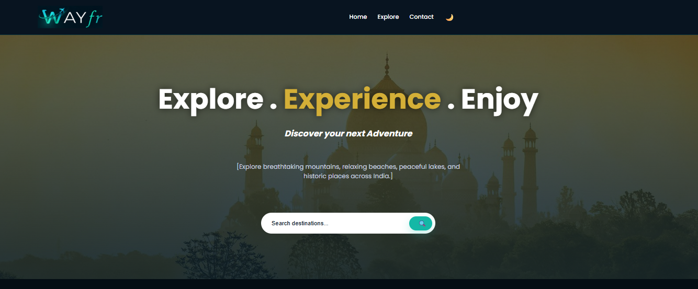
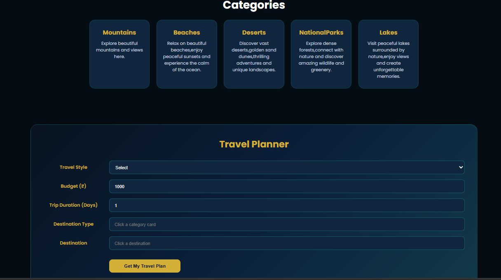

# 🌍 WAYfr — Explore Incredible India

> A responsive travel discovery website designed to help users explore incredible destinations across India.

## 🔗 Live Demo

[🌍 Visit WAYfr](https://vani-nehra.github.io/WAYfr/)

### Home Page

### Categories

### Contact

## ✨ Overview
WAYfr is a frontend travel discovery platform that provides an interactive experience for exploring destinations across India.

Users can browse destinations by category, search for specific places, select a destination, and generate a personalized travel plan based on their travel preferences.

## 🚀 Features
- Responsive travel discovery interface
- Destination search functionality
- Interactive destination categories
- Dynamic destination cards
- Destination ratings
- Interactive travel planner
- Budget and trip-duration selection
- Dark / light theme toggle
- Contact section
- Responsive design for different screen sizes
- Smooth hover effects and animations

## 🗂️ Destination Categories

WAYfr currently includes:

- 🏔️ Mountains
- 🏖️ Beaches
- 🏜️ Deserts
- 🌳 National Parks
- 🌊 Lakes

## 🛠️ Technologies Used

- HTML5
- CSS3
- JavaScript
- Google Fonts
- Responsive Web Design
- Local JavaScript Data

## 🚀 How to Run

1. Clone or download this repository.
2. Open the `WAYfr` folder in VS Code.
3. Open `index.html` in your browser.

For the best development experience, you can use the Live Server extension in VS Code.

## 🎯 Project Goal

The goal of WAYfr is to create a visually engaging and interactive frontend experience for discovering travel destinations across India.

The project focuses on responsive design, interactive user experiences, dynamic destination rendering, and simple travel planning functionality.

## 🔮 Future Improvements

Possible future enhancements include:

- 🌦️ Weather information
- ✈️ Flight information
- 🎉 Events and activities
- 📍 More destinations
- 🗺️ Advanced trip planning
- 🤖 AI-powered travel recommendations
- 🔐 User accounts and authentication
- 💾 Saved trips and favourite destinations
- ⚙️ Backend integration

## 👩‍💻 Author
**Vani Nehra**
Computer Science & Engineering — AIML

⭐ If you like this project, consider giving the repository a star!
